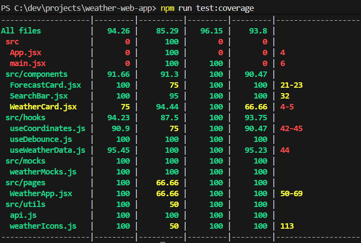
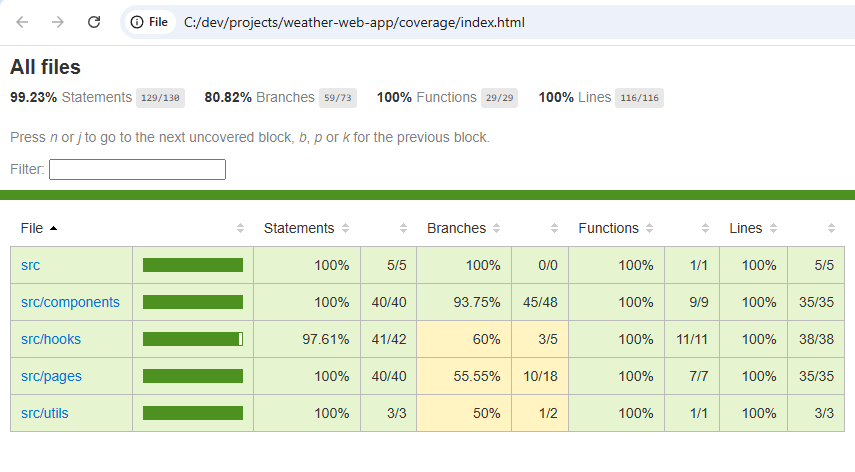

# React + Vite

This template provides a minimal setup to get React working in Vite with HMR and some ESLint rules.

Currently, two official plugins are available:

- [@vitejs/plugin-react](https://github.com/vitejs/vite-plugin-react/blob/main/packages/plugin-react) uses [Babel](https://babeljs.io/) for Fast Refresh
- [@vitejs/plugin-react-swc](https://github.com/vitejs/vite-plugin-react/blob/main/packages/plugin-react-swc) uses [SWC](https://swc.rs/) for Fast Refresh

## Expanding the ESLint configuration

If you are developing a production application, we recommend using TypeScript with type-aware lint rules enabled. Check out the [TS template](https://github.com/vitejs/vite/tree/main/packages/create-vite/template-react-ts) for information on how to integrate TypeScript and [`typescript-eslint`](https://typescript-eslint.io) in your project.

## Testing

This project includes both **unit tests** and **end-to-end (E2E) tests** to ensure the Weather app works correctly.

### Unit Tests

- Written with **Vitest** and **React Testing Library**.
- Covers components, hooks, and API interactions in isolation.
- Mocked API responses ensure tests are **fast and deterministic**.
- Run unit tests with coverage:

```bash
npm run test:coverage
```



### End-to-End (E2E) Tests

- Written with Cypress.
- Simulates real user interactions: searching for cities, selecting from dropdown, viewing current weather and forecast, handling errors.
- Run E2E tests:

```bash
npm run test:e2e
```

⚠️ **Warning:** Make sure the app is running locally (via `netlify de`v) before running Cypress..

### Combined Coverage

- Unit + E2E test coverage is collected with **Istanbul**.
- Coverage shows which lines, branches, and functions are tested by both unit and E2E tests.
- Run the combined coverage report:

```bash
npm run coverage
```

This command will:

1. Run unit tests with coverage
2. Run Cypress E2E tests
3. Merge coverage
4. Generate an HTML report in /coverage and open it in your default browser



## Deployment

The Weather app is deployed on **Netlify** with a **serverless backend** to securely handle API keys and sensitive credentials.

Unlike a S3 deployment, Netlify provides built-in serverless backend and secret management — reducing setup overhead and fitting my short delivery deadline.

### How Secrets Are Managed

The app uses two APIs:

1. **Geo API** – requires an API key.
2. **Meteomatics API** – requires a username and password.

To keep these secrets safe:

- All sensitive keys and credentials are stored in **Netlify environment variables** (`GEO_API_KEY`, `METEOMATICS_USER`, `METEOMATICS_PASS`).
- No secrets are exposed in the client-side code.

### Serverless Backend

To securely access the APIs:

- Hooks (`useCoordinates`, `useWeatherData`) were refactored to call **Netlify Lambda functions** instead of directly calling external APIs from the frontend.
- Lambda functions act as a **proxy**, injecting the required API credentials from environment variables.
- This architecture ensures that API keys and credentials **never appear in the browser**.

### Notes

- Using serverless functions ensures the frontend remains lightweight and secure.
- All API requests are proxied through Lambda, allowing for easy debugging and logging without exposing secrets.
- You can test serverless functions locally with:

```bash
netlify dev
```
