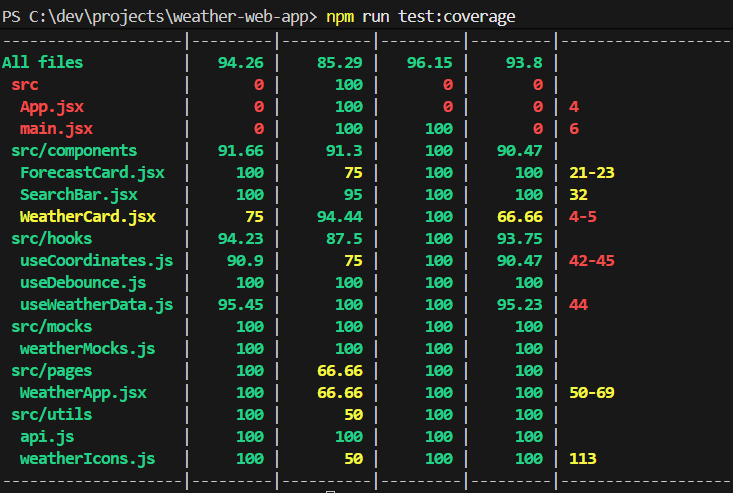
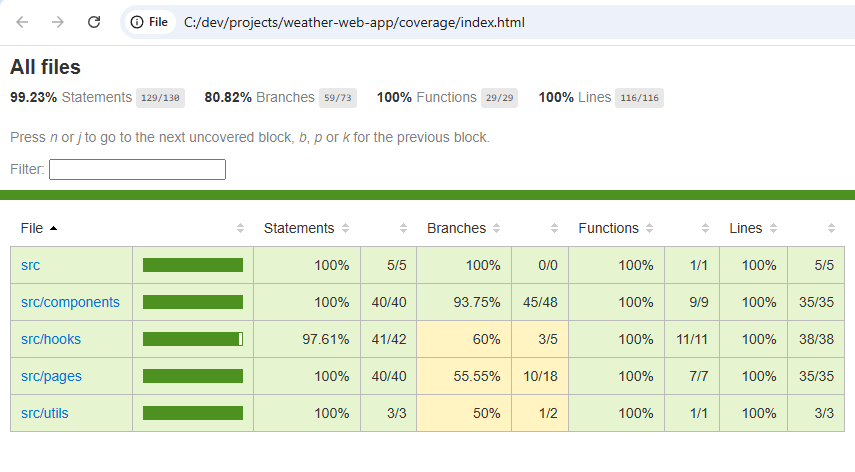
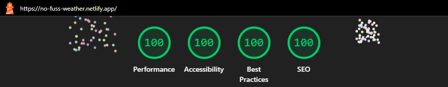
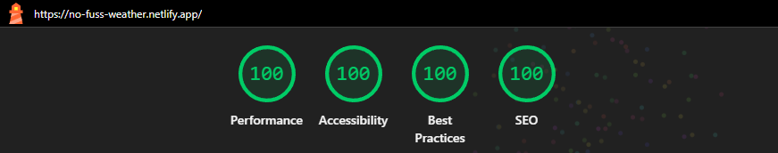
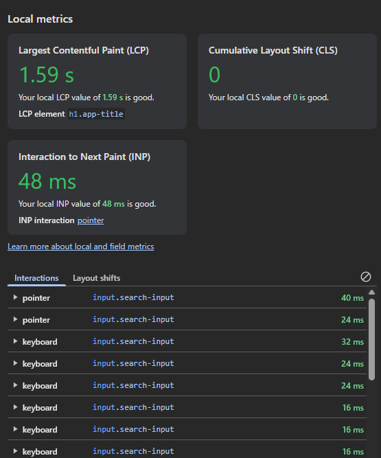
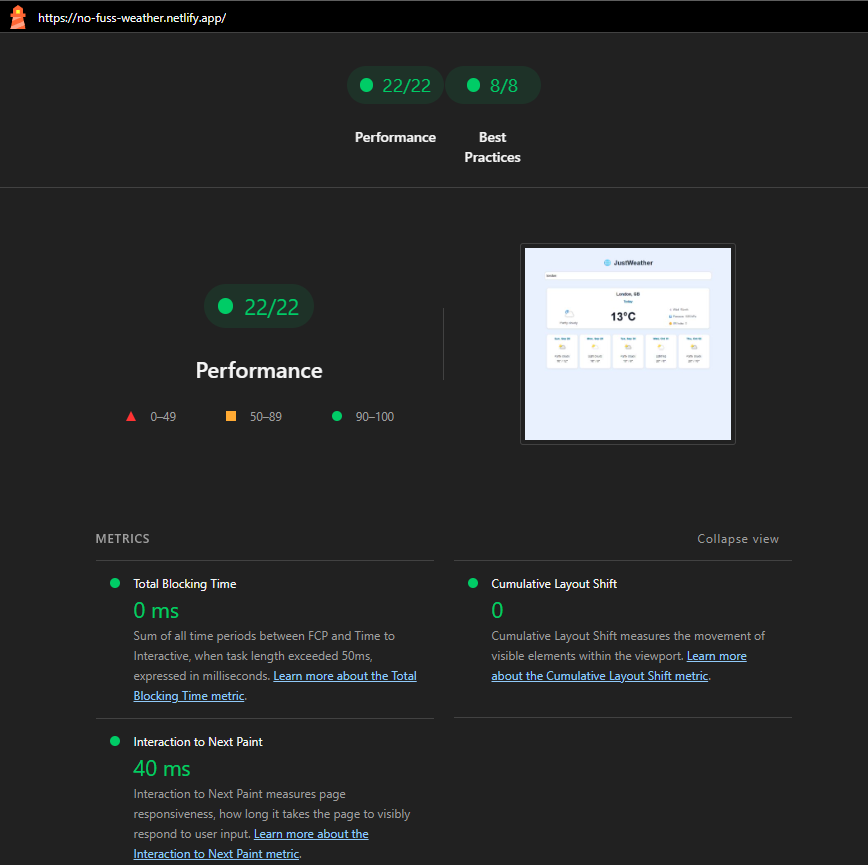
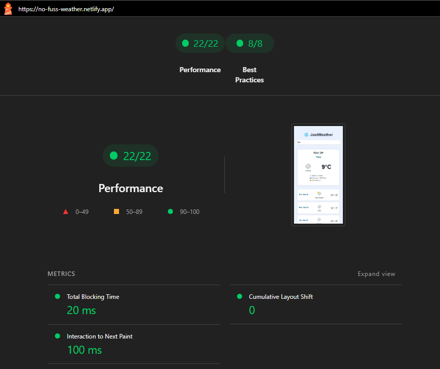
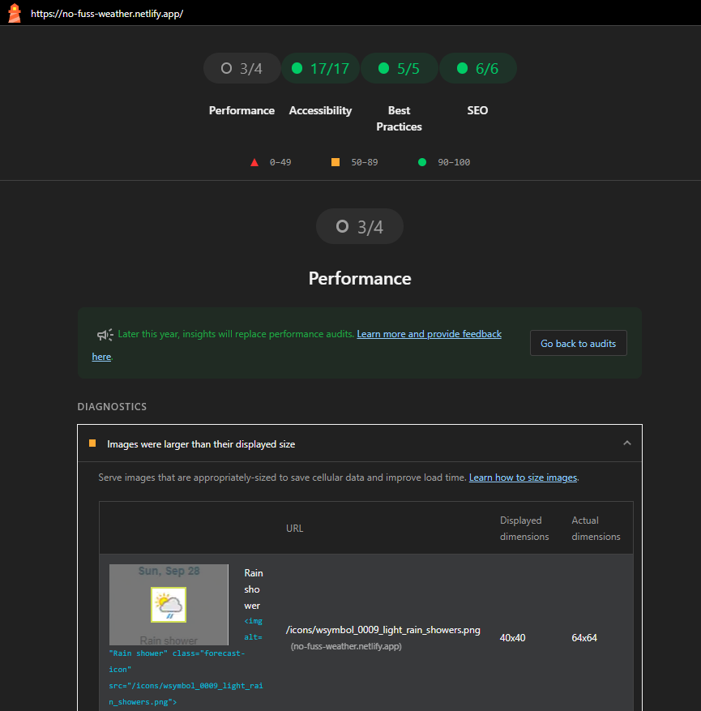
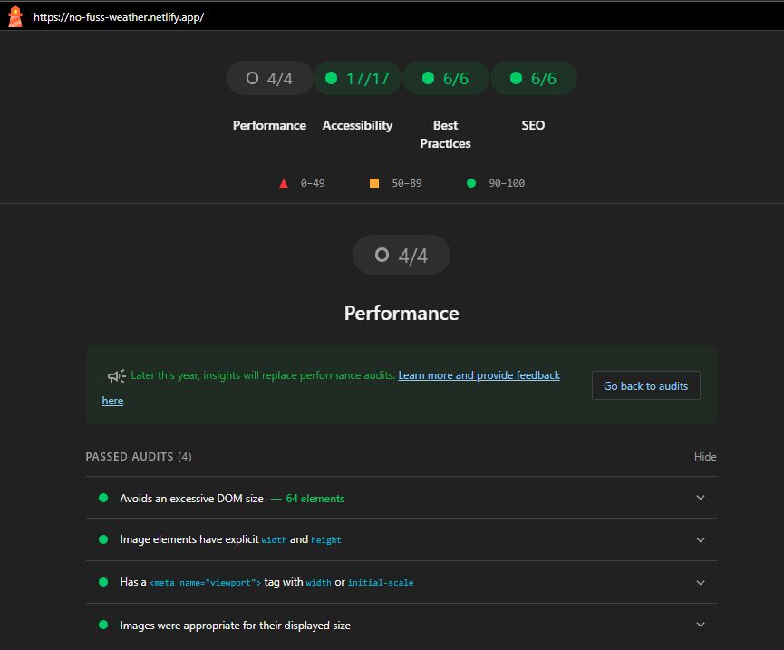

# JustWeather 🌐

Fast, sleek, and fully responsive — check the weather anywhere, anytime.  
Instant city search, clear forecasts, and current conditions — all with a secure serverless backend.

## 🛠️ Tech Stack

This application is built with a React 19 + Vite stack for fast development, responsive UI, and optimized performance, while leveraging React Query for efficient caching and Netlify serverless functions to securely handle API keys and reduce backend latency.

- **React 19** – Component-based architecture for a responsive, dynamic UI.
- **Vite** – Lightning-fast build tool for efficient development.
- **TypeScript** – Type safety and improved developer experience.
- **React Query** – Caching and fetching of API data for instant responses.
- **Axios** – HTTP requests to external APIs.
- **Netlify Functions** – Serverless backend to secure API keys and proxy external requests.
- **ESLint + Prettier** – Enforced code quality and consistent formatting.
- **Cypress & Vitest** – End-to-end and unit testing for reliability.
- **Rollup Visualizer** – Helps inspect bundle size and structure. More educational than necessary for a project of this scale.

## 🧪 Testing

This project includes both **unit tests** and **end-to-end (E2E) tests** to ensure the Weather app works correctly.

### Unit Tests

- Written with **Vitest** and **React Testing Library**.
- Covers components, hooks, and API interactions in isolation.
- Mocked API responses ensure tests are **fast and deterministic**.
- Run unit tests with coverage:

```bash
npm run test:coverage
```

<details> <summary>See unit test report</summary>

</details>

### End-to-End (E2E) Tests

- Written with Cypress.
- Simulates real user interactions: searching for cities, selecting from dropdown, viewing current weather and forecast, handling errors.
- Run E2E tests:

```bash
npm run test:e2e
```

⚠️ **Warning:** Make sure the app is running locally (via `netlify de`v) before running Cypress..

### Combined Coverage

- Unit + E2E test coverage is collected with **Istanbul**.
- Coverage shows which lines, branches, and functions are tested by both unit and E2E tests.
- Run the combined coverage report:

```bash
npm run coverage
```

This command will:

1. Run unit tests with coverage
2. Run Cypress E2E tests
3. Merge coverage
4. Generate an HTML report in /coverage and open it in your default browser



## ♿ Accessibility

**JustWeather** is designed with accessibility in mind:

- **Keyboard navigation** – All interactive elements (search input, city options) are focusable and can be selected via **Enter** or **Space** keys.
- **ARIA roles & attributes** – Search results, errors, and loading states use proper roles (`role="option"`, `role="alert"`, `role="status"`) with `aria-live` for dynamic updates.
- **Semantic UI** – Headings, lists, and labels follow semantic HTML for assistive technologies.
- **Visual & non-visual feedback** – Icons include `aria-hidden` where decorative, and text alternatives for weather descriptions.

Accessibility was verified with **Lighthouse**, achieving **100% accessibility score**.

**Desktop:**



**Mobile:**



## 🚀 Deployment

The Weather app is deployed on **Netlify** with a **serverless backend** to securely handle API keys and sensitive credentials.

Unlike a S3 deployment, Netlify provides built-in serverless backend and secret management — reducing setup overhead and fitting my short delivery deadline.

### How Secrets Are Managed

The app uses two APIs:

1. **Geo API** – requires an API key.
2. **Meteomatics API** – requires a username and password.

To keep these secrets safe:

- All sensitive keys and credentials are stored in **Netlify environment variables** (`GEO_API_KEY`, `METEOMATICS_USER`, `METEOMATICS_PASS`).
- No secrets are exposed in the client-side code.

### Serverless Backend

To securely access the APIs:

- Hooks (`useCoordinates`, `useWeatherData`) were refactored to call **Netlify Lambda functions** instead of directly calling external APIs from the frontend.
- Lambda functions act as a **proxy**, injecting the required API credentials from environment variables.
- This architecture ensures that API keys and credentials **never appear in the browser**.

### Notes

- Using serverless functions ensures the frontend remains lightweight and secure.
- All API requests are proxied through Lambda, allowing for easy debugging and logging without exposing secrets.
- You can test serverless functions locally with:

```bash
netlify dev
```

## ⚡ Performance

The application was audited with **Lighthouse** and achieved a **100% performance score**. Local DevTools metrics indicate a fast, responsive, and visually stable user experience.

### Local Performance Metrics

- \*\*Largest Contentful Paint (LCP): main content (`h1.app-title`) loads quickly, comfortably under the 2.5 s threshold for good performance.
- \*\*Cumulative Layout Shift (CLS): no unexpected layout shifts, providing a visually stable experience.
- \*\*Interaction to Next Paint (INP): user interactions (typing/selecting city) respond immediately, under the 200 ms threshold.



### Implemented Optimizations

- **React Query caching** (`staleTime: 5 min`) for `useCoordinates` ensures repeat searches return instantly without new API calls.
- **Debounced search input** (`1000ms`) prevents exceeding Geo API rate limits while maintaining responsive suggestions.
- **Preloaded Meteomatics data** reduces redundant fetch delays.
- **Serverless Netlify Functions** secure API keys and minimize latency.
- **Optimized Vite build** with `esbuild` and efficient asset handling.
- **Shared weather icons**: single 64×64 PNG set used for current and forecast weather, rendered responsively (40×40 in forecast on desktop).
- **Bundle analysis**: main JS dominated by `react-dom-client.production.js` (~519 KB, ~70%), typical for React apps, but overall build is lightweight for a SPA.  
  To open analysis:

```bash
npx vite build
```

### Data State Management

The app uses a component-driven approach with custom hooks and selective caching:

- **React Query** is used only for useCoordinates (city search) to cache repeated queries for 5 minutes.
- **Weather data** is always fetched fresh to ensure up-to-date information.
- **Custom hooks** encapsulate fetching, caching, and error handling, keeping components focused on rendering.
- This approach avoids global state libraries (like Redux), making the app **lightweight, maintainable, and efficient**.

### Constraints

- Free API plan (**1 request/sec, max 300/day**) limits stress testing at high load.








